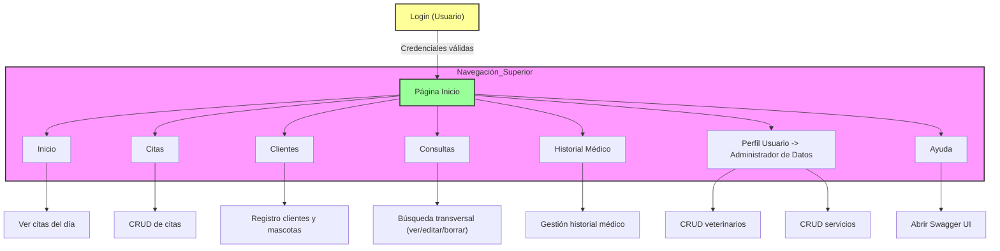
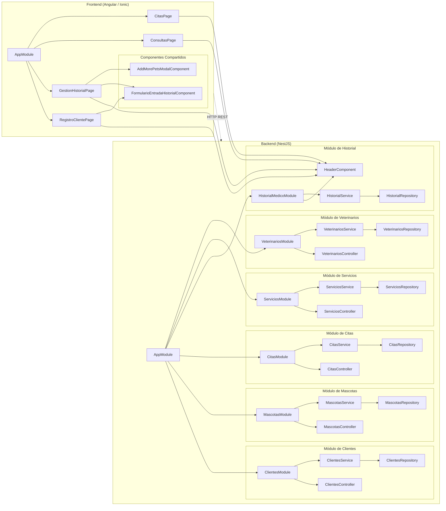

# VetAppointment


Software de gestión veterinaria para la administración de citas, pacientes e historiales médicos en clínicas.

## Tabla de Contenidos

* [Descripción](#descripción)
* [Objetivos](#objetivos)
* [Planificación](#planificación)
* [Presupuesto](#presupuesto)
* [Análisis de Mercado](#análisis-de-mercado)

  * [Público Objetivo y Perfiles de Usuario](#público-objetivo-y-perfiles-de-usuario)
  * [Competencia](#competencia)
* [Propuesta](#propuesta)
* [Especificaciones del Producto](#especificaciones-del-producto)
* [Diseño](#diseño)

  * [Diagramas de Navegación (User Flow)](#diagramas-de-navegación-user-flow)
  * [Wireframes](#wireframes)

    * [Fidelidad Baja](#fidelidad-baja)
    * [Fidelidad Media](#fidelidad-media)
    * [Fidelidad Alta](#fidelidad-alta)
* [Desarrollo](#desarrollo)

  * [Arquitectura de la Aplicación](#arquitectura-de-la-aplicación)
  * [Herramientas de Desarrollo](#herramientas-de-desarrollo)
  * [Tecnologías Utilizadas](#tecnologías-utilizadas)
  * [Modelo de Datos](#modelo-de-datos)
* [Despliegue](#despliegue)
* [Conclusiones](#conclusiones)
* [Líneas de Futuro](#líneas-de-futuro)

---

## Descripción

VetAppointment es una aplicación diseñada para uso exclusivo del personal clínico de una clínica veterinaria. Permite optimizar la programación de citas, la gestión de pacientes (mascotas) y el control de historiales médicos, reduciendo errores administrativos y mejorando la eficiencia en las consultas.

## Objetivos

* Centralizar la gestión de citas médicas.
* Almacenar y consultar historiales clínicos de mascotas.
* Organizar la agenda y asignar profesionales veterinarios.
* Control de acceso por roles (recepcionista, veterinario, administrador).
* Soporte multiplataforma (escritorio y móvil en red interna).

## Planificación


*Diagrama de Gantt que muestra las fases de análisis, diseño, desarrollo y despliegue.*

## Presupuesto

### 4.1 Costes de Personal

| Fase                                | Horas | Tarifa (€ / h) | Coste (€) |
|-------------------------------------|:-----:|:--------------:|---------:|
| Análisis de Mercado                 |  120  |       40       |   4 800  |
| Especificaciones y Planificación    |  128  |       40       |   5 120  |
| Diseño (User Flow + Wireframes)     |  224  |       35       |   7 840  |
| Desarrollo Frontend & Arquitectura  |  368  |       30       |  11 040  |
| Desarrollo Backend / API            |  368  |       30       |  11 040  |
| Pruebas e Integración               |  120  |       25       |   3 000  |
| Despliegue y Configuración          |  120  |       30       |   3 600  |
| Documentación y Conclusiones        |  128  |       25       |   3 200  |
| **Total Personal**                  | **1576** |      —      | **49 640** |

### 4.2 Infraestructura y Operaciones

| Concepto                               | Periodo      | Coste unitario | Coste (€)  |
|----------------------------------------|:------------:|:--------------:|----------:|
| Servidor de preproducción (VPS)        | Ene–May 2025 |    50 €/mes    | 5 × 50 = 250 |
| Dominio + SSL                          |    1 año     |       —        |     100   |
| Servicios en la nube (API)             | Ene–May 2025 |   100 €/mes    | 5 × 100 = 500 |
| **Total Infraestructura**              |              |                |   **850** |

### 4.3 Licencias y Herramientas

| Herramienta / Licencia        | Periodo    | Coste (€) |
|-------------------------------|:----------:|---------:|
| Angular Enterprise Support    |   1 año    |   1 000  |
| NestJS Enterprise Support     |   1 año    |     800  |
| Figma (UI/UX) – 5 usuarios    |    —       |     600  |
| Postman Pro – 3 usuarios      |    —       |     300  |
| **Total Licencias**           |            |   **2 700** |

### 4.4 Contingencia (10 %)

Para cubrir riesgos y posibles ampliaciones de alcance:

\[
(49\,640 + 850 + 2\,700) \times 0{,}10 = 5\,009\;\text{€}
\]

### 4.5 Gran Total

| Concepto               | Coste (€) |
|------------------------|---------:|
| Total Personal         |   49 640 |
| Total Infraestructura  |      850 |
| Total Licencias        |    2 700 |
| Contingencia (10 %)    |    5 009 |
| **TOTAL GENERAL**      | **58 199** |

---

## Análisis de Mercado en España

**Panorama General**
En España operan más de **7 100** clínicas veterinarias distribuidas por todo el territorio, con Madrid, Barcelona, Valencia, Alicante, Málaga y Sevilla a la cabeza en número de centros. El sector de animales de compañía facturó **2 613 millones de euros** en 2023, con un crecimiento interanual del **8,3%**.

### Tamaño y Crecimiento del Mercado de Software

* **Global:** el mercado mundial de software veterinario se estima en **USD 1,85 mil millones** para 2025, con una tasa de crecimiento anual compuesta (CAGR) del **6,1%** hasta 2030.
* **España:** aunque no hay datos públicos detallados, se estima que el gasto en software de gestión representa el **1 – 2%** de la facturación clínica anual, lo que supondría un mercado de **26 – 52 millones de euros** en 2023, con un crecimiento anual cercano al **6 – 7%**.

### Factores Impulsores

1. **Humanización de las mascotas:** el censo de perros supera los **9,29 millones** y el de gatos los **1,6 millones**, creando demanda de servicios veterinarios especializados.
2. **Normativa y trazabilidad:** nuevas regulaciones sobre receta electrónica y dispensación de fármacos exigen sistemas que garanticen el cumplimiento legal.
3. **Digitalización post-COVID:** aumento de teleconsulta y gestión remota, favoreciendo soluciones en la nube y acceso multi-dispositivo.

### Segmentación del Mercado

* **Por tamaño de clínica:**

  * **Pequeñas (1–2 veterinarios):** soluciones SaaS desde **25–50 €/mes**.
  * **Medianas (3–5 veterinarios):** paquetes con facturación avanzada, CRM y agendas compartidas.
  * **Grandes (>5 veterinarios):** sistemas on-premise personalizables e integraciones con laboratorio y ERP.
* **Por modelo de despliegue:**

  * **Cloud/SaaS (\~60%):** escalado sencillo y coste inicial bajo.
  * **Instalado (Windows/Linux):** preferido por clínicas con infraestructura TI propia.

### Público Objetivo y Perfiles de Usuario

* **Recepcionistas:** Gestionan citas y vinculan mascotas con propietarios.
* **Veterinarios:** Acceden y actualizan el historial clínico, consultan su agenda.
* **Administradores:** Gestionan usuarios, supervisan estadísticas y salud del sistema.

### Competencia

* **VetWin:** Completo, pero interfaz anticuada y curva de aprendizaje elevada.
* **ClinicCloud:** Basado en la nube, con coste mensual y funcionalidades genéricas.
* **GestVet:** Sencillo, pero limitado en personalización y escalabilidad.

VetAppointment destaca por ser modular, escalable y sin costes de licencia, aprovechando software libre.

## Propuesta

Desarrollar una plataforma interna que permita registrar, consultar y administrar citas, pacientes y profesionales de forma centralizada, segura y eficiente, con una interfaz intuitiva centrada en el personal clínico.

## Especificaciones del Producto

1. Crear, modificar, visualizar y eliminar citas médicas.
2. Registrar y consultar historiales clínicos completos.
3. Gestionar veterinarios y sus horarios.
4. Agenda visual diaria, semanal y mensual.
5. Control de acceso por roles.
6. Compatibilidad con dispositivos de escritorio y móviles.

## Diseño

## Diagramas de Navegación (User Flow)



### Wireframes

#### Fidelidad Baja


Bosquejo inicial en papel para definir estructura y jerarquía de elementos.

#### Fidelidad Media


Prototipo digital con componentes básicos y navegación definida.

#### Fidelidad Alta


Diseño final con tipografía, colores y elementos de UI reales.

## Desarrollo

### Arquitectura de la Aplicación



**Frontend:** Angular v14 modularizado en CoreModule, SharedModule y módulos funcionales (Clientes, Mascotas, Citas, Facturación, Historial Médico, Servicios, Veterinarios). Estilos con Angular Material.

**Backend:** NestJS con módulos específicos para cada entidad, validación con class-validator y documentación via Swagger.

**Base de Datos:** MongoDB (no-relacional)

### Herramientas de Desarrollo

* Visual Studio Code
* Git & GitHub
* Postman
* Figma
* Angular CLI & Nest CLI

### Tecnologías Utilizadas

| Capa       | Tecnología / Biblioteca   | Uso Principal                            |
| ---------- | ------------------------- | ---------------------------------------- |
| Frontend   | Angular, Ionic, Bootstrap | SPA y responsive móvil/web               |
| Backend    | NestJS (TypeScript)       | API REST y lógica de negocio             |
| Base Datos | MongoDB     | Almacenamiento no-relacional                |
| Seguridad  | JWT, Bcrypt               | Autenticación y cifrado de contraseñas (Trabajo futuro)   |
| Otros      | RxJS, Angular Forms       | Manejo reactivo y gestión de formularios |

### Modelo de Datos


Entidades principales: Cliente ↔ Mascota → Historial Médico → Entrada Historial; Veterinario ↔ Cita; Servicio Prestado.

## Despliegue

1. Clonar repositorio: `git clone [https://github.com/tu-org/vetappointment.git](https://github.com/florinasamoila/vetappointment)`
2. Configurar `.env` con credenciales de base de datos.
3. Instalar dependencias:

   ```bash
   npm install
   cd backend && npm install
   ```
4. Ejecutar migraciones y seeders:

   ```bash
   npm run migrate:up
   npm run seed:run
   ```
5. Iniciar servidores:

   ```bash
   ng serve --open      # Frontend
   cd backend && npm run start:dev # Backend
   ```

## Conclusiones

VetAppointment ofrece una solución moderna y eficiente para la gestión interna de clínicas veterinarias, con una arquitectura escalable y una interfaz enfocada en mejorar la productividad del personal.

## Líneas de Futuro

* Módulo completo de facturación y generación de comprobantes.
* Notificaciones por email/SMS para recordatorios de citas.
* Dashboard de métricas clínicas.
* Gestión de stock médico.
* Internacionalización (i18n).
* Backups automáticos y herramientas de recuperación.
